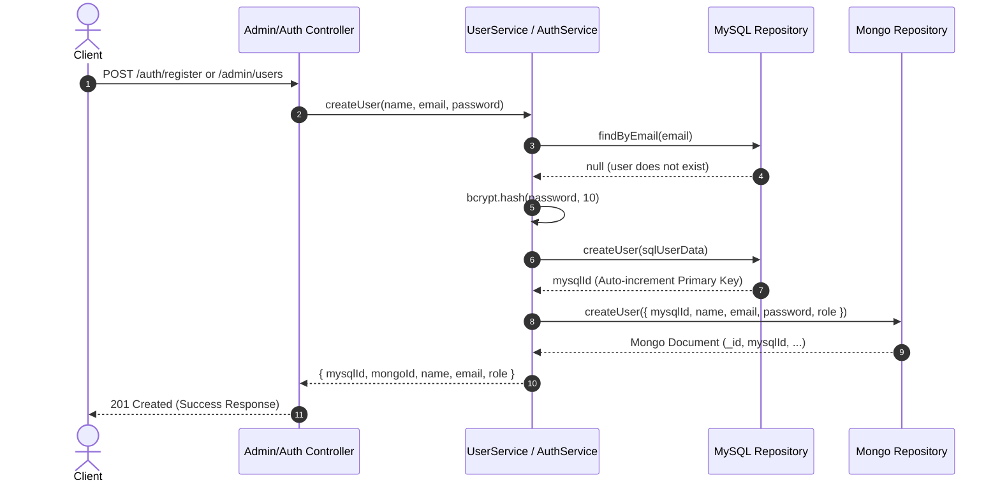

<!-- Slide 1: Title -->
# 🚀 Enterprise User Management API
### Hybrid Dual-Database Architecture with RBAC & JWT Authentication

**Built with TypeScript, Express.js, MySQL & MongoDB**

---

<!-- Slide 2: Executive Summary -->
## 📌 Executive Summary

* **Project Purpose:** A secure, robust, and scalable User Management RESTful API designed to manage user lifecycles, authentication, and administration.
* **Core Innovation:** **Hybrid Dual-Database Architecture** syncing structured relational data in **MySQL** with flexible document records in **MongoDB**.
* **Key Capabilities:**
  * Stateless **JWT (JSON Web Token)** Authentication.
  * **Role-Based Access Control (RBAC)** separating `ADMIN` and `USER` permissions.
  * Strict layered enterprise pattern: **Routes → Middleware → Controllers → Services → Repositories → Databases**.
  * Strongly typed end-to-end with **TypeScript 5.x**.

---

<!-- Slide 3: Tech Stack -->
## 🛠️ Technology Stack

| Layer | Technology | Key Capabilities |
| :--- | :--- | :--- |
| **Language** | **TypeScript 5.9** | Static typing, interface definitions, robust tooling |
| **Runtime & Framework** | **Node.js + Express 5.2** | High-performance asynchronous HTTP server |
| **Relational Database** | **MySQL (mysql2)** | ACID compliance, relational integrity, primary auto-increment IDs |
| **Document Database** | **MongoDB (Mongoose 9.9)**| Flexible document store, fast retrieval, JSON-native schema |
| **Security & Cryptography** | **Bcrypt + JWT** | Salted password hashing (10 rounds), signed tamper-proof tokens |
| **Dev Tooling** | **ts-node-dev, dotenv** | Live hot-reloading, zero-transpile dev overhead, env isolation |

---

<!-- Slide 5: System Architecture -->
## 🏗️ Clean Layered Architecture

```
[ HTTP Request ]
       │
       ▼
┌────────────────────────────────────────────────────────┐
│  Routes Layer (/auth, /admin, /user)                  │
└──────────────────────┬─────────────────────────────────┘
                       │
                       ▼
┌────────────────────────────────────────────────────────┐
│  Middleware Pipeline (AuthMiddleware, RoleMiddleware)  │
└──────────────────────┬─────────────────────────────────┘
                       │
                       ▼
┌────────────────────────────────────────────────────────┐
│  Controllers Layer (Request validation & HTTP mapping) │
└──────────────────────┬─────────────────────────────────┘
                       │
                       ▼
┌────────────────────────────────────────────────────────┐
│  Services Layer (Business logic, hashing, sync logic)  │
└──────────────┬──────────────────────────┬──────────────┘
               │                          │
               ▼                          ▼
┌─────────────────────────┐    ┌─────────────────────────┐
│  SQL Repository         │    │  Mongo Repository       │
└──────────────┬──────────┘    └──────────┬──────────────┘
               │                          │
               ▼                          ▼
      [( MySQL Pool )]            [( MongoDB Mongoose )]
```

---

<!-- Slide 6: Dual-Database Data Synchronization Flow -->
## 🔄 Dual-Database Sync Sequence



---

<!-- Slide 7: Database Schemas -->
## 🗄️ Database Schemas & Mapping

### MySQL Schema (`users`)
```sql
CREATE TABLE users (
  id INT AUTO_INCREMENT PRIMARY KEY,
  name VARCHAR(255) NOT NULL,
  email VARCHAR(255) NOT NULL UNIQUE,
  password VARCHAR(255) NOT NULL,
  role ENUM('ADMIN', 'USER') DEFAULT 'USER',
  created_at TIMESTAMP DEFAULT CURRENT_TIMESTAMP,
  updated_at TIMESTAMP DEFAULT CURRENT_TIMESTAMP ON UPDATE CURRENT_TIMESTAMP
);
```

### MongoDB Mongoose Schema (`UserModel`)
```typescript
const userSchema = new Schema<IUser>({
  mysqlId:  { type: Number, required: true, unique: true }, // Foreign link to MySQL
  name:     { type: String, required: true },
  email:    { type: String, required: true, unique: true },
  password: { type: String, required: true },
  role:     { type: String, enum: ["ADMIN", "USER"], default: "USER" }
}, { timestamps: true });
```

---

<!-- Slide 8: Security & Authentication Pipeline -->
## 🔐 Authentication & RBAC Flow

```
   [ Incoming Request ]
            │
            ▼
┌──────────────────────────────────────┐
│  1. Check 'Authorization' Header     │ ──(Missing/Invalid)──► [ 401 Unauthorized ]
└──────────────────┬───────────────────┘
                   │  "Bearer <JWT_TOKEN>"
                   ▼
┌──────────────────────────────────────┐
│  2. jwt.verify(token, JWT_SECRET)    │ ──(Expired/Tampered)─► [ 401 Unauthorized ]
└──────────────────┬───────────────────┘
                   │  Decoded: { email, role }
                   ▼
┌──────────────────────────────────────┐
│  3. Attach payload to req.user       │
└──────────────────┬───────────────────┘
                   │
                   ▼
┌──────────────────────────────────────┐
│  4. Role Verification (RoleMiddleware)│ ──(Role !== ADMIN)──► [ 403 Forbidden ]
└──────────────────┬───────────────────┘
                   │  Role === "ADMIN"
                   ▼
         [ Proceed to Controller ]
```

---

<!-- Slide 9: API Endpoints Directory -->
## 📡 API Endpoints Matrix

### Authentication Endpoints (`/auth`)
| Method | Endpoint | Auth Required | Description |
| :--- | :--- | :---: | :--- |
| `POST` | `/auth/register` | ❌ Public | Register a new user account (defaults to `USER` role) |
| `POST` | `/auth/login` | ❌ Public | Validate credentials & receive signed JWT bearer token |

### Administrative Endpoints (`/admin`)
| Method | Endpoint | Auth Required | Description |
| :--- | :--- | :---: | :--- |
| `GET` | `/admin/users` | 🔒 `ADMIN` | Fetch all users simultaneously from MySQL and MongoDB |
| `POST` | `/admin/users` | 🔒 `ADMIN` | Create user directly with administrative privileges |
| `GET` | `/admin/users/:id` | 🔒 `ADMIN` | Retrieve combined SQL & Mongo record for specific ID |
| `PUT` | `/admin/users/:id` | 🔒 `ADMIN` | Update user details across both databases |
| `DELETE` | `/admin/users/:id`| 🔒 `ADMIN` | Atomic delete from MySQL and MongoDB |

---

<!-- Slide 10: Deep Dive: Service Layer -->
## 💡 Service Layer Intelligence

* **Validation First:** Validates email presence, name length (min 3 chars), and password strength (min 6 chars) before DB roundtrips.
* **Duplicate Detection:** Pre-checks email uniqueness in MySQL to avoid partial sync failures.
* **Password Encryption:** Uses salted `bcrypt` hashing with salt cost factor 10.
* **Synchronized Updates:**
  1. Validates that the requested user ID exists.
  2. Ensures target email is not already taken by another user (`emailUser.id !== id`).
  3. Updates SQL table record.
  4. Updates matching MongoDB document using `mysqlId`.

---

<!-- Slide 11: Deep Dive: Middleware Layer -->
## 🛡️ Modular Middleware Pipeline

### 1. `AuthMiddleware.authenticate`
* Extracts and parses the `Authorization: Bearer <token>` header.
* Validates cryptographic signature using `process.env.JWT_SECRET`.
* Enriches the Express request object with strongly-typed `AuthRequest.user`.

```typescript
export interface AuthRequest extends Request {
  user?: { email: string; role: "USER" | "ADMIN" };
}
```

### 2. `RoleMiddleware.adminOnly`
* Guards protected routes against non-admin requests.
* Rejects unauthorized callers with clear, actionable HTTP status codes (`401 Unauthorized` / `403 Forbidden`).

---

<!-- Slide 12: Request & Response Examples -->
## 📦 Sample API Payloads

### Login Response (`POST /auth/login`)
```json
{
  "success": true,
  "message": "Login successful",
  "token": "eyJhbGciOiJIUzI1NiIsInR5cCI6IkpXVCJ9...",
  "user": {
    "id": 1,
    "name": "Admin User",
    "email": "admin@example.com",
    "role": "ADMIN"
  }
}
```

### Combined Admin Query (`GET /admin/users/1`)
```json
{
  "success": true,
  "user": {
    "sqlUser": {
      "id": 1,
      "name": "Admin User",
      "email": "admin@example.com",
      "role": "ADMIN",
      "created_at": "2026-09-02T06:30:00.000Z"
    },
    "mongoUser": {
      "_id": "66d56d1f9a2b8e3a12345678",
      "mysqlId": 1,
      "name": "Admin User",
      "email": "admin@example.com",
      "role": "ADMIN"
    }
  }
}
```

<!-- Slide 13: Project Structure -->
## 📁 Codebase Directory Structure

```
user-management-api/
├── src/
│   ├── config/               # Database connections & connection pools
│   │   ├── mongodb.ts        # Mongoose connection handler
│   │   └── mysql.ts          # MySQL2 connection pool
│   ├── controllers/          # HTTP request handlers & response formatters
│   │   ├── admin.controller.ts
│   │   └── auth.controller.ts
│   ├── middleware/           # Interceptors & security guards
│   │   ├── auth.middleware.ts
│   │   └── role.middleware.ts
│   ├── models/               # ODM Schemas & Interfaces
│   │   └── user.model.ts     # Mongoose User Document Schema
│   ├── repositories/         # Data Access Layer (Abstraction over queries)
│   │   ├── mongo-user.repository.ts
│   │   └── sql-user.repository.ts
│   ├── routes/               # API route definitions & route grouping
│   │   ├── admin.routes.ts
│   │   ├── auth.routes.ts
│   │   └── user.routes.ts
│   ├── services/             # Core business logic & sync orchestration
│   │   ├── auth.service.ts
│   │   └── user.service.ts
│   ├── app.ts                # Express application configuration
│   └── server.ts             # Server bootstrap & connection initialization
├── .env                      # Environment configuration
├── package.json              # Dependencies and scripts
└── tsconfig.json             # TypeScript compiler settings
```

<!-- Slide 15: Conclusion & Q&A -->
## 🎓 Summary & Key Takeaways

* **Full-Featured Hybrid Backend:** Combines relational rigor (MySQL) with document flexibility (MongoDB).
* **Enterprise Patterns:** Strict adherence to Repository, Service, and Layered Controller architectures.
* **Production-Grade Security:** Encrypted passwords, stateless signed tokens, and role-based route protection.
* **Maintainable & Typed:** 100% TypeScript coverage with clear interfaces and clean separation of concerns.